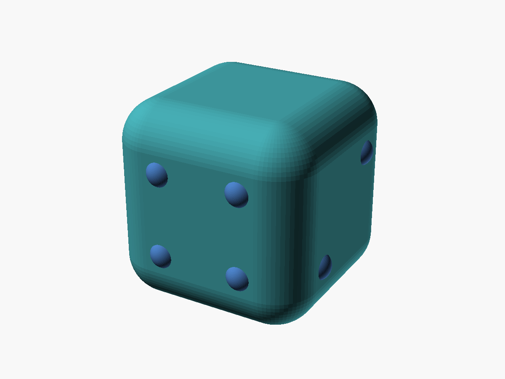
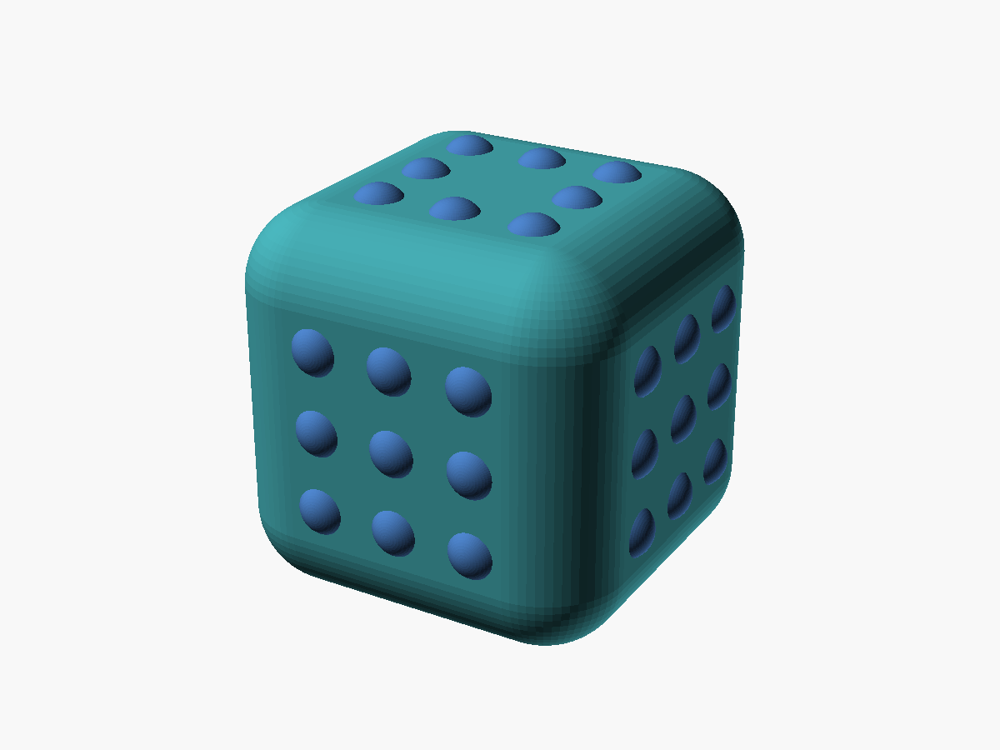
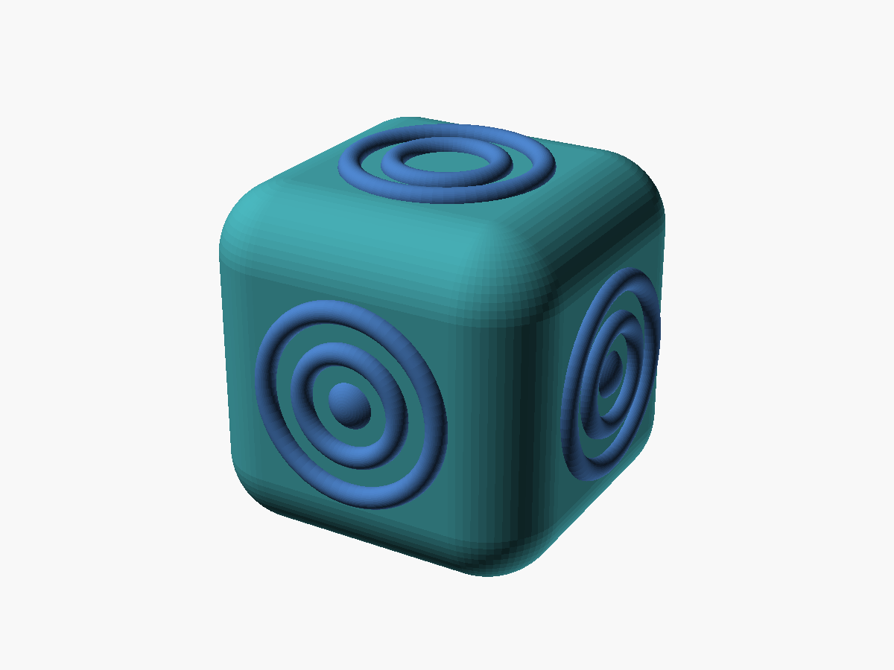
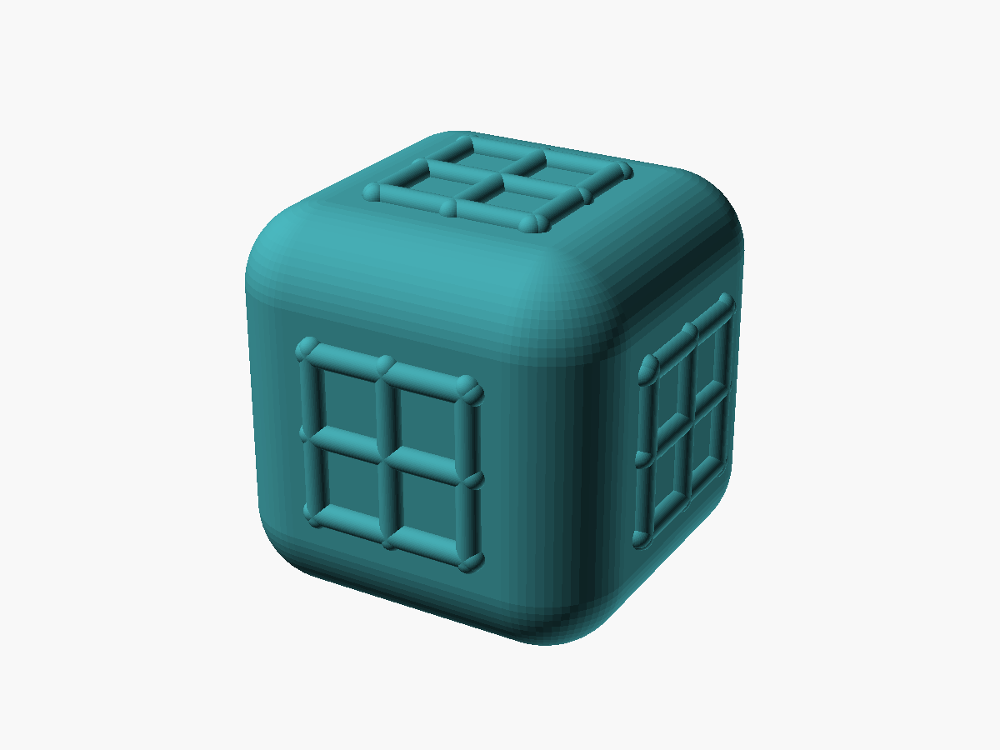
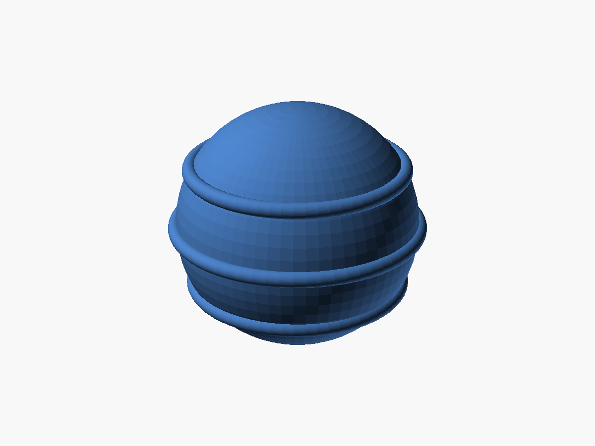
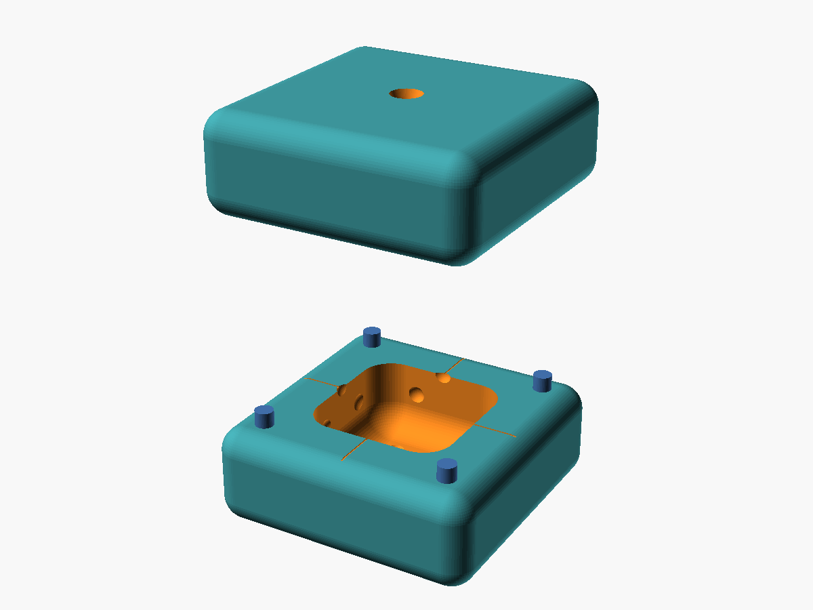
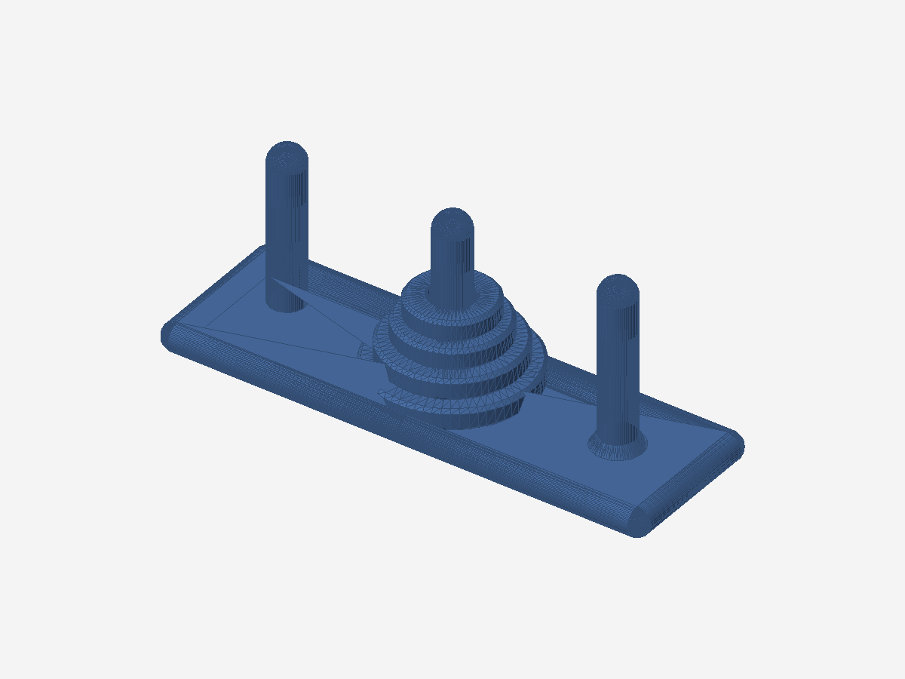
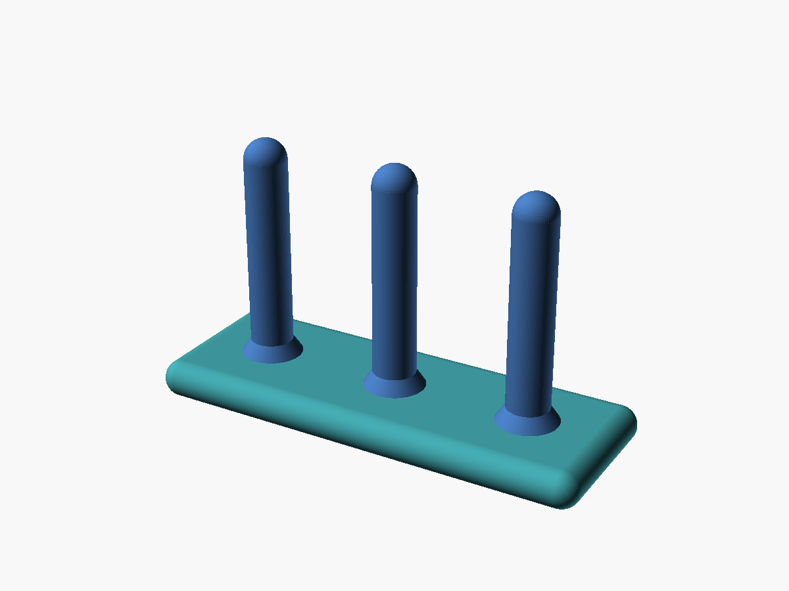
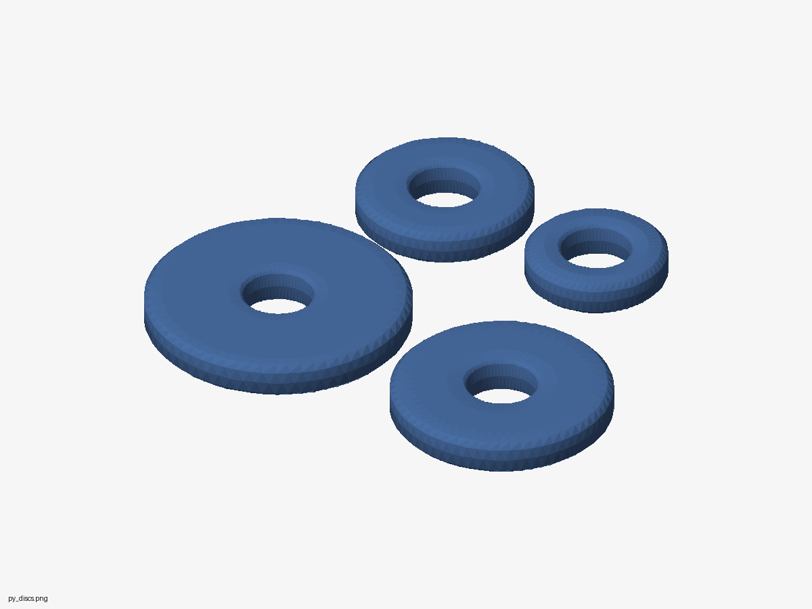
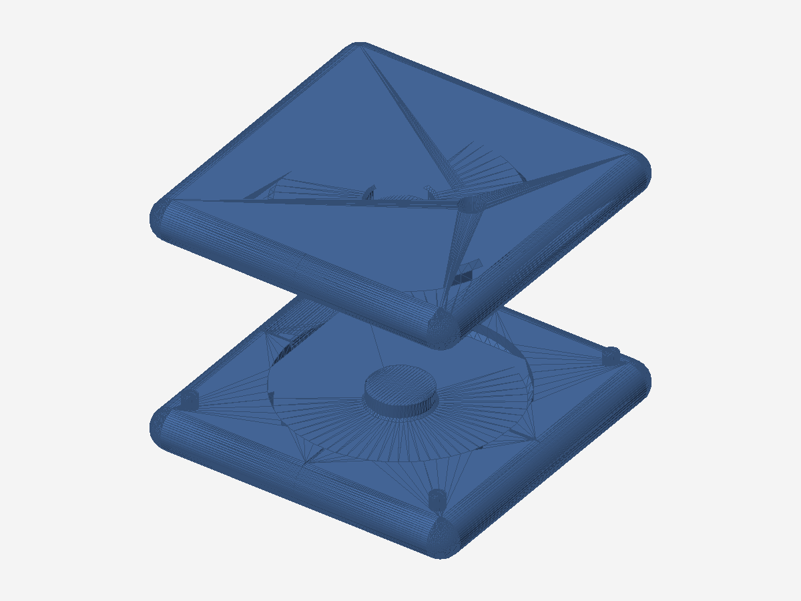

# 3D 婴儿积木(0-1 岁)· 食品级硅胶浇注

为 0-1 岁口欲期宝宝设计的咬咬积木家庭自制方案：**3D 打印只做母模、模具和硬质结构件，所有入口件用食品级铂金(加成型)硅胶浇注成型**——可煮沸消毒、咬不碎、无层纹藏菌风险。

## 产品线(按月龄)

| 阶段 | 产品 | 材料 | 说明 |
|---|---|---|---|
| 3-6 月(主打) | P1 咬咬积木 ×6 | 硅胶 Shore 00-50 | 本仓库交付：软骰子 / 点阵 / 同心环 / 编织纹 / 软胶球 |
| 6-9 月 | P2 软叠叠杯 ×5 | 硅胶 Shore A10 | Φ55-95 嵌套，杯底排水孔 |
| 9-12 月(监督使用) | P3 形状投放盒 | PETG 盒 + 硅胶块 | 硬质件不入口 |
| 9-12 月+ | 汉诺塔 `hanoi.scad` | PETG 架 + 硅胶盘 ×4 | 三柱底座一体打印(监督使用)，盘 Φ48-90 可啃可煮 |
| 9-12 月+ | 空心滚滚球 `roll_ball.scad` | PETG/PLA 一体打印 | 70mm 闭合空腔 + 三条防滑纬环，爬行追逐用，**不作牙胶**，无嵌入无配重 |
| 9-12 月+ | 不倒翁系列 `tumbler.scad` | PETG/PLA 一体打印 | 蛋形/球形两款,底部配重帽+上部空腔(重心 -6.3/-7.1mm)推倒回正;**切片填充 100%**,不作牙胶 |
| 9-12 月+ | 12 生肖不倒翁 `zodiac_tumbler.scad` | PETG/PLA 一体 | 12 款共用回正内核+生肖顶部特征,v2脸部大五官+平底Φ40贴床,重心全负(-2.0~-4.3);免支撑单色,**填充 100%**,两板打完 |
  └ 成品合板 STL:`stl/zodiac_plate1.stl` + `zodiac_plate2.stl`(3x2 居中排样 231x159,直接拖进切片器)

## 安全红线

- 任一部件最小外形尺寸 **≥ 45mm**(不得放入小零件试验器 Φ31.7mm)
- 禁止锥形/楔形尖头，角部圆角 ≥ 8mm
- 一体成型，无小件 / 无磁铁 / 无电池
- 禁止封闭积水腔(进水 = 霉菌)
- 材料白名单：食品级**铂金(加成型)**硅胶 + 食品级 PETG；禁用缩合型硅胶、ABS、光敏树脂接触件
- 成品须通过验收清单(小零件 / 拉力 / 扭力 / 跌落 / 煮沸 / 咬合 / 防霉)才交给宝宝

完整方案见 [`3D婴儿积木设计方案.md`](./3D婴儿积木设计方案.md)。

## 文件结构

```
├── 3D婴儿积木设计方案.md   # 完整设计方案(红线/工艺/验收/里程碑)
├── baby_blocks_p1.scad     # P1 参数化模型:5 款积木 + 两瓣硅胶模具
├── hanoi.scad              # 汉诺塔:PETG 底座三柱 + 硅胶盘 ×4 + 盘模
├── roll_ball.scad          # 空心滚滚球:70mm 闭合空腔 + 防滑纬环
├── tumbler.scad           # 不倒翁系列:蛋/球两型,配重帽+空腔回正,填充100%
├── zodiac_tumbler.scad     # 12 生肖不倒翁:回正内核+12 款顶部特征,免支撑单色
├── renders/                # 渲染预览图(积木 5 款 + 模具 + 汉诺塔 4 张)
├── render.ps1              # OpenSCAD 批量渲染脚本模板
└── stl_vol.py              # STL 体积验证(signed volume + 包围盒)
```

## 快速开始

1. 用 OpenSCAD 打开 `baby_blocks_p1.scad`
2. 顶部 Customizer 选择:
   - `PART`:`dice` / `dots` / `rings` / `weave` / `ball`
   - `VIEW`:`block`(积木本体)、`mold_bottom` / `mold_top` / `mold_split`(模具)
3. 渲染导出 STL(模具两瓣分别导出)
4. 验证几何:`python stl_vol.py mold_bottom.stl`(下模理论约 187000 mm³)

命令行批量出图(静默,不弹窗):

```powershell
& "C:\Program Files\OpenSCAD\openscad.com" -o out.png `
  --imgsize=1200,900 --autocenter --viewall `
  --camera=0,0,0,65,0,30,500 --projection=p --colorscheme=Tomorrow baby_blocks_p1.scad
```

## 模具打印与浇注

- 模具:PLA 打印,层高 0.10-0.12mm,壁 ≥ 3.6mm,**分型面朝上平放**
- 硅胶:食品级铂金(加成型),A:B=1:1(按所购说明),搅拌 3min → 脱泡 → 沿壁细流浇入顶部浇口(Φ10→Φ4)
- 固化:25°C 4-6h(或 60°C 烘箱 1-2h)→ 开模撕出 → 修剪浇口 → 洗洁精煮洗一次
- 禁用光敏树脂模具(会抑制铂金硅胶固化)

## 渲染图

| | |
|---|---|
|  |  |
|  |  |
|  |  |
| 汉诺塔成品 | |
|  |  |
| 硅胶盘 ×4 | 盘浇注模具 |
|  |  |
